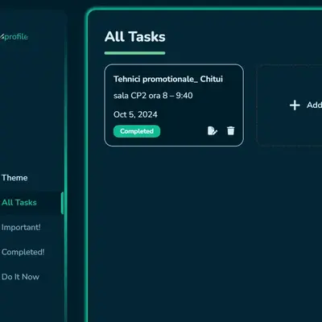

# Tasks — Full-Stack Task Manager (Next.js + Prisma)

> A full-stack task management application built with Next.js 14 App Router, Prisma ORM, and NextAuth authentication. Focused on performance, scalable data handling, and efficient UI updates.

[](https://tasks-dv.vercel.app)
[](https://nextjs.org/)
[](https://www.typescriptlang.org/)
[](https://www.prisma.io/)

---

## 📸 Preview

 
> 🔗 **[View live →](https://tasks-dv.vercel.app)**

---

## ✨ Features

- **Task CRUD** — create, read, update, and delete tasks with real-time feedback via `react-hot-toast`
- **Authentication** — NextAuth with protected routes, session management, and callback URL support
- **Route protection** — middleware-level redirect logic handles unauthenticated and authenticated users
- **Prisma ORM** — type-safe database queries with auto-generated client
- **Performance monitoring** — Vercel Analytics and Speed Insights integrated out of the box
- **Date handling** — moment.js for flexible date formatting and relative time display
- **Responsive UI** — Tailwind CSS + SCSS + Styled Components

---

## 🛠️ Tech Stack

| Technology | Purpose |
|---|---|
| Next.js 14 (App Router) | Full-stack React framework |
| TypeScript | Type safety throughout |
| Prisma 6 + Prisma Adapter | ORM & database schema management |
| NextAuth | Authentication & session management |
| bcryptjs | Password hashing |
| Tailwind CSS + SCSS | Styling |
| Styled Components | Dynamic component styles |
| Axios | HTTP client |
| react-hot-toast | Toast notifications |
| Vercel Analytics + Speed Insights | Performance monitoring |

---

## 📁 Project Structure

```
tasks/
├── app/                   # Next.js App Router
│   ├── api/               # API route handlers
│   ├── auth/              # Sign in / sign up pages
│   └── (protected)/       # Auth-gated routes
├── prisma/
│   └── schema.prisma      # Database schema
├── types/                 # Shared TypeScript types
├── scripts/               # Utility scripts
├── public/images/         # Static assets
├── middleware.ts          # Route protection logic
└── tailwind.config.ts
```

---

## 🔐 Authentication Flow

Route protection is handled at the middleware level:

- **Auth routes**  — redirects already authenticated users away
- **Protected routes** — everything else — redirects unauthenticated users to `/auth/signin` with a `callbackUrl` so users land back where they intended after login
- **Passwords** — hashed with `bcryptjs` before storage

---

## 👤 Author

**David Gelu-Fanel** — Full-Stack Developer

[](https://davidgelu.netlify.app)
[](https://linkedin.com/in/gelu-fanel-david)
[](https://github.com/david-gelu)